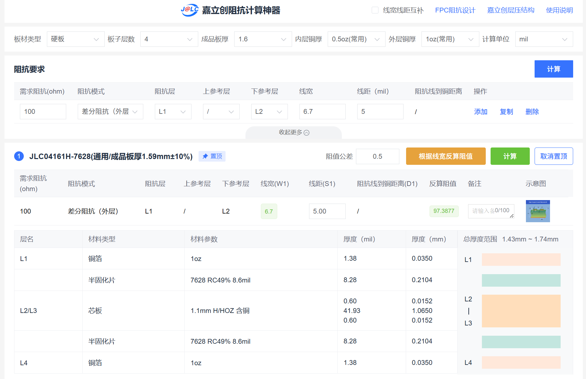
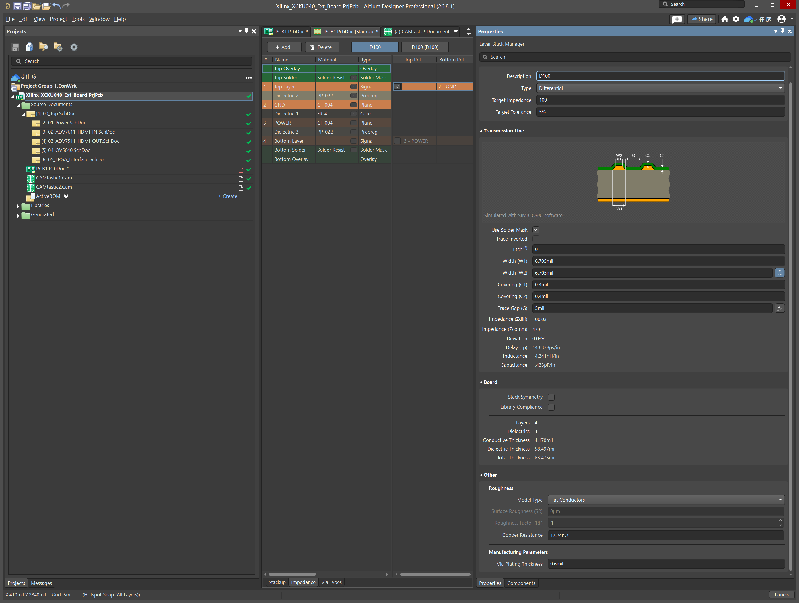

# Xilinx XCKU040 120Pin 多功能视频扩展板

> 基于 Xilinx Kintex UltraScale XCKU040 FPGA 板卡设计的 120Pin 多功能扩展板，集成 HDMI 输入、HDMI 输出、OV5640 摄像头接口及配套电平转换和保护电路，用于 FPGA 视频采集、处理与显示实验。

[English](README_EN.md)

---

## 项目简介

本项目是为一块基于 **Xilinx Kintex UltraScale XCKU040** 的 FPGA 板卡设计的 120Pin 多功能扩展板。

原 FPGA 板卡提供 PCIe、SFP+、高速收发器等资源，并预留了一组 120Pin 板对板扩展接口，但缺少适合视频采集、视频输出和摄像头实验的外围硬件。

本扩展板利用该 120Pin 接口扩展 HDMI 输入、HDMI 输出和 OV5640 摄像头等功能，构建一套面向 FPGA 视频与图像处理实验的硬件平台。

扩展板主要包含：

- ADV7611 HDMI 视频输入
- ADV7511 HDMI 视频输出
- OV5640 DVP 摄像头接口
- FPGA 120Pin 板对板接口
- 1.8V / 3.3V 数字电平转换
- I2C / DDC 双向电平转换
- HDMI TMDS ESD 防护
- 1.8V / 3.3V 电源分配与去耦电路

后续计划基于该硬件平台实现 HDMI 视频环回、摄像头实时显示、图像处理、视频缓存以及 PCIe / 10GbE 高速视频数据传输等功能。

> **当前状态：硬件原理图、PCB Layout、DRC 检查及生产文件已经完成，PCB 已提交制造，目前正在制板，尚未进行实板功能验证。**

---

## 主要功能

- HDMI 视频输入
- HDMI 视频输出
- OV5640 DVP 摄像头输入
- FPGA 120Pin 高密度扩展接口
- 24-bit 并行视频数据传输
- 1.8V / 3.3V IO 电平转换
- I2C / SCCB / DDC 双向电平转换
- HDMI TMDS 高速信号 ESD 防护
- HDMI HPD / CEC 等控制接口
- 四层 PCB 高速数字设计
- HDMI TMDS 100Ω 差分阻抗设计
- 并行视频总线组内等长
- 独立 GND 参考平面
- 1.8V / 3.3V 电源平面

---

## 主要硬件

| 模块 | 器件 / 接口 | 功能 |
|---|---|---|
| FPGA | Xilinx XCKU040 | 视频处理与系统核心 |
| FPGA 接口 | 120Pin Board-to-Board | 扩展板与 FPGA 主板连接 |
| HDMI 输入 | ADV7611 | HDMI 视频接收 |
| HDMI 输出 | ADV7511 | HDMI 视频发送 |
| 摄像头 | OV5640 | DVP 图像采集 |
| 并行电平转换 | SN74LVC8T245 | 1.8V / 3.3V 数字信号电平转换 |
| I2C 电平转换 | PCA9306 | I2C / SCCB / DDC 双向电平转换 |
| HDMI ESD | TPD4E05U06 | HDMI TMDS 高速信号 ESD 防护 |
| 电源 | 1.8V / 3.3V | FPGA IO 与外围器件供电 |

---

## 系统结构

整个扩展板围绕 XCKU040 FPGA 构建三条主要数据链路。

### HDMI 输入链路

HDMI 输入信号首先进入 ADV7611。

ADV7611 完成 HDMI TMDS 接收，并将视频转换为并行数字视频信号。并行数据经过电平转换后进入 XCKU040 FPGA，由 FPGA 完成后续的视频处理。

数据方向为：

**HDMI IN → ADV7611 → 电平转换 → XCKU040 FPGA**

### HDMI 输出链路

FPGA 输出处理后的并行数字视频数据，经电平转换后送入 ADV7511。

ADV7511 将并行视频数据转换为 HDMI TMDS 信号，并通过 HDMI 接口输出至显示设备。

数据方向为：

**XCKU040 FPGA → 电平转换 → ADV7511 → HDMI OUT**

### 摄像头链路

OV5640 通过 DVP 接口向 FPGA 输出图像数据，FPGA 可直接完成图像采集和处理，并通过 ADV7511 输出至 HDMI 显示设备。

数据方向为：

**OV5640 → XCKU040 FPGA → ADV7511 → HDMI OUT**

---

## HDMI 输入

HDMI 输入部分采用 **ADV7611** HDMI 接收器。

ADV7611 用于接收 HDMI TMDS 信号，并输出 FPGA 可以处理的并行数字视频数据。

主要视频信号包括：

- D0 ~ D23
- Pixel Clock
- HSYNC
- VSYNC
- DE

同时包含：

- I2C
- DDC
- HPD
- CEC

HDMI TMDS 信号在 HDMI 接口附近加入 **TPD4E05U06** 进行 ESD 防护。

ADV7611 与 FPGA 之间根据 IO 电平需求使用数字电平转换器完成 3.3V 与 1.8V 之间的电平匹配。

HDMI 输入部分的设计目标为最高 **1080p60**。

> 1080p60 为硬件设计目标，实际工作能力将在实板完成后进行验证。

---

## HDMI 输出

HDMI 输出部分采用 **ADV7511** HDMI 发送器。

FPGA 向 ADV7511 提供并行数字视频信号，主要包括：

- D0 ~ D23
- Pixel Clock
- HSYNC
- VSYNC
- DE

ADV7511 将 FPGA 输出的并行视频数据编码并转换为 HDMI TMDS 信号。

同时提供：

- I2C
- DDC
- HPD
- CEC

HDMI TMDS 输出同样配置 ESD 防护器件。

HDMI 输出部分的设计目标为最高 **1080p60**。

本版本主要面向 FPGA 视频和图像处理实验，因此未加入 HDMI 音频链路。

---

## OV5640 摄像头接口

扩展板提供一路 **OV5640 DVP 摄像头接口**。

主要信号包括：

- D0 ~ D7
- PCLK
- VSYNC
- HREF
- SCCB / I2C
- RESET
- PWDN

该接口主要用于后续 FPGA 图像采集与处理实验。

计划实现的功能包括：

- OV5640 初始化
- FPGA 图像采集
- 摄像头实时视频显示
- OV5640 → FPGA → HDMI 视频输出
- 图像滤波
- 边缘检测
- OSD 字符与图形叠加
- 视频裁剪与缩放
- Frame Buffer
- FPGA 图像处理流水线

---

## FPGA 120Pin 接口

扩展板通过 **120Pin 板对板连接器**与 XCKU040 FPGA 主板连接。

120Pin 接口主要承担以下信号：

- ADV7611 并行视频数据
- ADV7511 并行视频数据
- OV5640 DVP 数据
- Pixel Clock
- HSYNC / VSYNC / DE
- I2C / SCCB
- HPD
- CEC
- RESET
- 其他控制信号
- 1.8V / 3.3V 电源
- GND

FPGA 扩展 IO 主要工作在 **1.8V**，因此板上部分 3.3V 外围器件需要通过电平转换芯片后与 FPGA 连接。

---

## PCB 设计

PCB 尺寸为：

**100 mm × 60 mm**

采用四层 PCB 结构。

| 层 | 用途 |
|---|---|
| L1 | Top Signal |
| L2 | GND |
| L3 | POWER |
| L4 | Bottom Signal |

其中：

- L1 主要用于器件布局和高速信号布线
- L2 作为完整 GND 参考平面
- L3 用于 1.8V、3.3V 等电源分配
- L4 用于部分信号布线及辅助连接

PCB 设计主要考虑以下内容：

- HDMI TMDS 差分信号完整性
- 连续 GND 参考平面
- 高速信号回流路径
- 并行视频总线组内等长
- 电源完整性
- 去耦电容布局
- GND Stitching Via
- HDMI 接口 ESD 防护
- 1.8V / 3.3V 电源区域划分
- 高速信号尽量减少换层和过孔

---

## HDMI TMDS 布线

HDMI TMDS 按 **100Ω 差分阻抗**进行设计。

根据 PCB 层叠进行阻抗计算后，对 HDMI TMDS 差分信号设置独立的布线规则。

主要设计参数约为：

| 参数 | 数值 |
|---|---|
| 目标差分阻抗 | 100Ω |
| 单线线宽 | 约 6.7 mil |
| 差分间距 | 5 mil |
| 参考层 | L2 GND |
HDMI TMDS 差分对按照 100Ω 差分阻抗设计，基于 JLC04161H-7628 层叠计算，设计值约为 97.4Ω。

TMDS 差分对在布局布线过程中重点保证：

- P / N 对内长度匹配
- 差分间距稳定
- 尽量减少过孔
- 保持连续参考地
- 避免跨越参考平面分割
- ESD 器件靠近 HDMI 接口放置







---

## 并行视频总线

ADV7611、ADV7511 与 FPGA 之间存在多组高速并行视频信号。

为了降低各数据位之间的时序偏斜，对相关信号进行了组内长度匹配。

主要包括：

- ADV7611 D0 ~ D23
- ADV7611 Pixel Clock
- ADV7611 HSYNC / VSYNC / DE
- ADV7511 D0 ~ D23
- ADV7511 Pixel Clock
- ADV7511 HSYNC / VSYNC / DE
- OV5640 D0 ~ D7
- OV5640 PCLK / VSYNC / HREF

---

## 电源设计

扩展板主要使用：

- 1.8V
- 3.3V

两组主要电源。

其中 1.8V 主要用于 FPGA IO 侧，3.3V 主要用于外围视频器件及相关接口。

PCB L3 POWER 层划分对应的电源区域，并在各芯片电源引脚附近布置去耦电容。

电源设计主要考虑：

- 芯片电源去耦
- 电源平面完整性
- 电源回流路径
- 电平转换器两侧电源匹配
- 不同电压域之间的隔离

---

## ESD 防护

HDMI 接口属于直接暴露在外部的高速接口，因此 HDMI TMDS 信号加入专用高速 ESD 防护。

采用：

**TPD4E05U06**

ESD 器件尽量靠近 HDMI 连接器放置，以缩短外部静电进入 PCB 后的传播路径。

---

## 原理图结构

原理图按照功能模块划分为多个 Sheet。

| Sheet | 功能 |
|---|---|
| 00_Top | 系统顶层连接 |
| 01_Power | 电源设计 |
| 02_ADV7611_HDMI_IN | ADV7611 HDMI 输入 |
| 03_ADV7511_HDMI_OUT | ADV7511 HDMI 输出 |
| 04_OV5640 | OV5640 摄像头接口 |
| 05_FPGA_Interface | FPGA 120Pin 接口 |

采用分层原理图结构便于后续进行模块检查、修改和维护。

---

## 仓库内容

仓库包含本扩展板的主要设计文件与制造输出文件。

| 文件 | 内容 |
|---|---|
| 00_Top.SchDoc | 系统顶层原理图 |
| 01_Power.SchDoc | 电源原理图 |
| 02_ADV7611_HDMI_IN.SchDoc | HDMI 输入原理图 |
| 03_ADV7511_HDMI_OUT.SchDoc | HDMI 输出原理图 |
| 04_OV5640.SchDoc | OV5640 接口原理图 |
| 05_FPGA_Interface.SchDoc | FPGA 接口原理图 |
| PCB1.PcbDoc | PCB Layout |
| PCB1.PcbLib | PCB 封装库 |
| Xilinx_XCKU040_Ext_Board.SCHLIB | 原理图库 |
| Xilinx_XCKU040_Ext_Board.PrjPcb | Altium Designer 工程 |
| Manufacturing Files | Gerber / Drill 等生产文件 |

---

## 开发环境

### PCB 设计

- Altium Designer
- 嘉立创 EDA Professional

### FPGA 开发

- Xilinx Vivado
- Verilog / SystemVerilog

### FPGA 平台

- Xilinx Kintex UltraScale XCKU040

---

## 项目进度

### 硬件设计

- [√] 系统方案设计
- [√] 电源设计
- [√] ADV7611 HDMI 输入原理图
- [√] ADV7511 HDMI 输出原理图
- [√] OV5640 摄像头接口
- [√] FPGA 120Pin 接口
- [√] 数字电平转换电路
- [√] I2C / DDC 电平转换
- [√] HDMI ESD 防护
- [√] PCB 器件布局
- [√] 四层 PCB 布线
- [√] HDMI TMDS 差分阻抗设计
- [√] HDMI TMDS 差分布线
- [√] 并行视频总线等长
- [√] GND Stitching Via
- [√] 电源平面设计
- [√] DRC 检查
- [√] Gerber / NC Drill 输出
- [√] 最终制板文件整理

### PCB 制造

- [√] PCB 文件提交
- [√] PCB 下单
- [√] PCB 制板中
- [ ] PCB 收板
- [ ] 元器件焊接

### 硬件验证

- [ ] PCB 外观与加工质量检查
- [ ] 电源网络短路检查
- [ ] 1.8V / 3.3V 电源测试
- [ ] FPGA 120Pin 接口测试
- [ ] I2C / SCCB 通信测试
- [ ] OV5640 初始化
- [ ] OV5640 图像采集
- [ ] ADV7611 初始化
- [ ] HDMI 输入测试
- [ ] ADV7511 初始化
- [ ] HDMI 输出测试
- [ ] HDMI IN → FPGA → HDMI OUT 视频环回
- [ ] 1080p60 视频链路验证

---

## 后续计划

PCB 制造、焊接和基础硬件验证完成后，将开始 FPGA 逻辑开发。

计划逐步实现：

- HDMI 输入驱动
- HDMI 输出驱动
- HDMI IN → HDMI OUT 视频直通
- OV5640 初始化与图像采集
- OV5640 实时 HDMI 显示
- RGB / YCbCr 视频格式处理
- OSD 字符与图形叠加
- 图像滤波
- 边缘检测
- 视频裁剪与缩放
- DDR Frame Buffer
- 多级视频处理流水线
- PCIe 视频数据传输
- 10GbE 视频数据传输
- FPGA 图像算法加速
- FPGA + AI 异构计算实验

随着实板验证和 FPGA 开发的推进，相关测试结果、实板照片、FPGA 工程及开发记录将继续更新到本仓库。

---

## 当前状态

**2026.08**

本项目已经完成硬件设计阶段，目前 PCB 已提交制造并进入制板阶段。


收到 PCB 后将首先进行外观检查、电源短路检查和分阶段上电测试，在确认基础硬件工作正常后，再开始 OV5640、ADV7611 和 ADV7511 的功能验证。

---

## 注意事项

> [!WARNING]
> 本项目目前仍处于硬件原型阶段，PCB 正在制造，尚未完成实板验证。

如果需要参考本项目进行制板或二次开发，请重新检查：

- XCKU040 120Pin 接口定义
- FPGA Bank IO 电压
- 1.8V / 3.3V 电平兼容性
- ADV7611 外围电路
- ADV7511 外围电路
- OV5640 接口定义
- PCB 层叠参数
- HDMI TMDS 差分阻抗
- 器件封装
- 电源设计
- Gerber / Drill 文件

在完成实板验证之前，本项目不应被视为已经验证的量产级设计。

---

## Author

**GentleUlrica**

GitHub: **GentleUlrica**

---

## License

当前暂未指定开源许可证。

如需参考、修改或制造本项目，请在使用前自行检查硬件设计、接口定义和制造文件。
```
